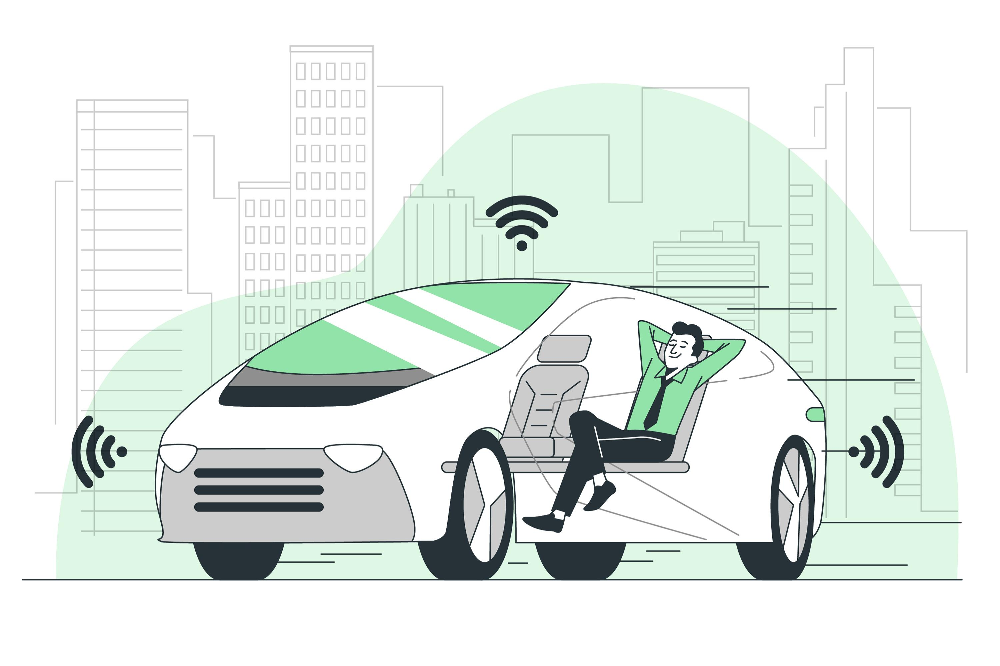

# Enhancing Driver Behavior Learning: Study on Feature Grouping and Combination
*Introducing a innovative way to categorize and combine car monitoring system data using engineering design concepts to improve driver behaviour prediction model accuracy. Autonomous driving is one of the most promising industry in travel and transportation. Environmental perception modules are playing crucial roles in automatic driving system and driving behaviour prediction. The modules use various type of sensors to construct the perception of real-time road environment. The popular sensors used includes ultrasonic radar systems, LiDAR, cameras, and internal vehicle SCADA.Our approach enables us to assess the significance of each group of data features on the driver learning behavior prediction model’s success, with a stronger emphasis on engineering considerations rather than being constrained by the limitations or capabilities of specific sensors.*

## Philosophy
Sensory systems are directly liable for the quality of collected data which could affect the performance of a driving behaviour prediction system. Sometimes, We refrain from grouping data features based on sensors (data sources). Instead, in the study, we apply transportation engineering practices and road engineering design concepts to categorize the data features. We disregard the data sources and concentrated on categorizing them into similar functional and distinct categories. 123 collected feature are broken into 7 categories for model performance benchmarking,

## Notes
A non-disclosure agreement was signed with related project stakeholders. The codes and data for the development are saved in University of Waterloo's private GitLab Repository.

However, the development team is working on data cleaning, and aiming to release data & models as open source for community to enhance DBL studies! It is estimated that the project will be open source by early 2025.

## Project Page
For more information related to feature selection, feature grouping, model building, please review paper or use the link below:
https://delinm.github.io/Driving_Behaviour_Sensor_Data_Sutdy_Page/

